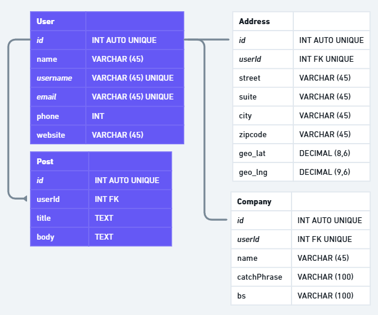

## Get it Started!

Run the development server:

```bash
npm run dev
# or
yarn dev
# or
pnpm dev
# or
bun dev
```

And open [http://localhost:3000](http://localhost:3000) with your browser to see the result.

## Used tools

- NextJS
- Prisma ORM
- SQLite
- Tailwind CSS
- Hero UI
- Nextjs Toast Notify

## Initial databse design

Database diagram scheme whimsical


